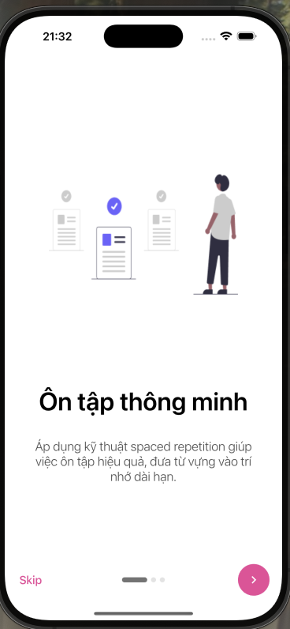
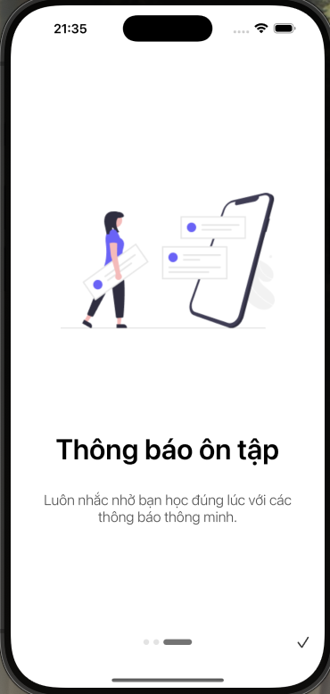
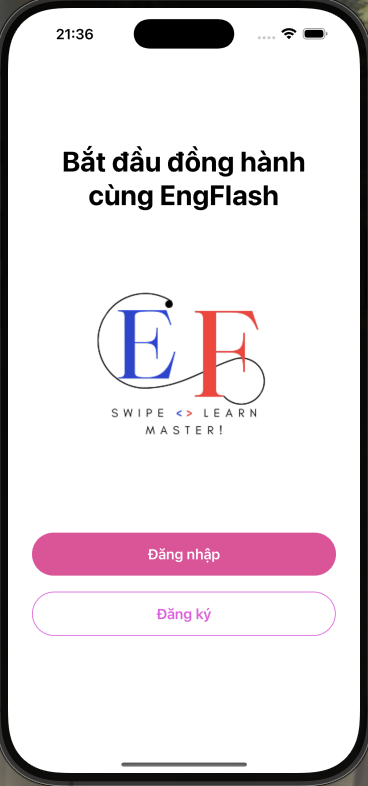
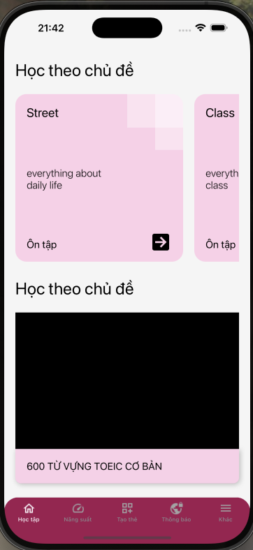
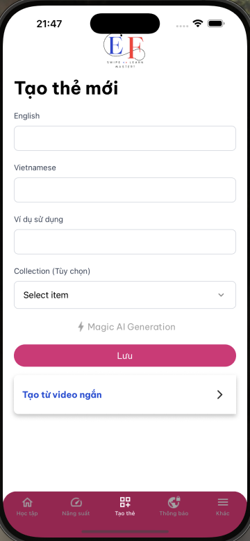
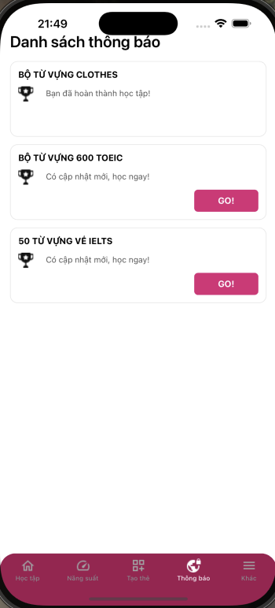
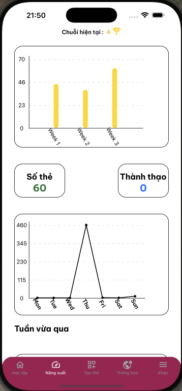

# EngFlash - Học tiếng anh khoa học qua Flashcard (Frontend)


EngFlash mang đến một giải pháp học tiếng Anh toàn diện với thẻ ghi nhớ. Ứng dụng không chỉ sử
dụng công nghệ flashcard và thuật toán spaced repetition để tối ưu hóa quá trình ghi nhớ mà còn tích
hợp các tính năng thông báo tự động và trích xuất collection từ video, giúp mở rộng phạm vi học tập
và cập nhật kiến thức theo thời gian thực. EngFlash giúp đáp ứng nhu cầu ngày càng cao của người học
trong việc xây dựng vốn từ vựng một cách hiệu quả.


## Install

1. Install dependencies

   ```bash
   npm install
   ```

2. Start the app

   ```bash
    npx expo start
   ```

In the output, you'll find options to open the app in a

- [development build](https://docs.expo.dev/develop/development-builds/introduction/)
- [Android emulator](https://docs.expo.dev/workflow/android-studio-emulator/)
- [iOS simulator](https://docs.expo.dev/workflow/ios-simulator/)
- [Expo Go](https://expo.dev/go), a limited sandbox for trying out app development with Expo

You can start developing by editing the files inside the **app** directory. This project uses [file-based routing](https://docs.expo.dev/router/introduction).

## Onboarding Screens

|  |  | | |
|:------------------------------:|:------------------------------:|:------------------------------:|:------------------------------:|

## Main Screens
<div>
    
    
     
    
     
     
</div>
